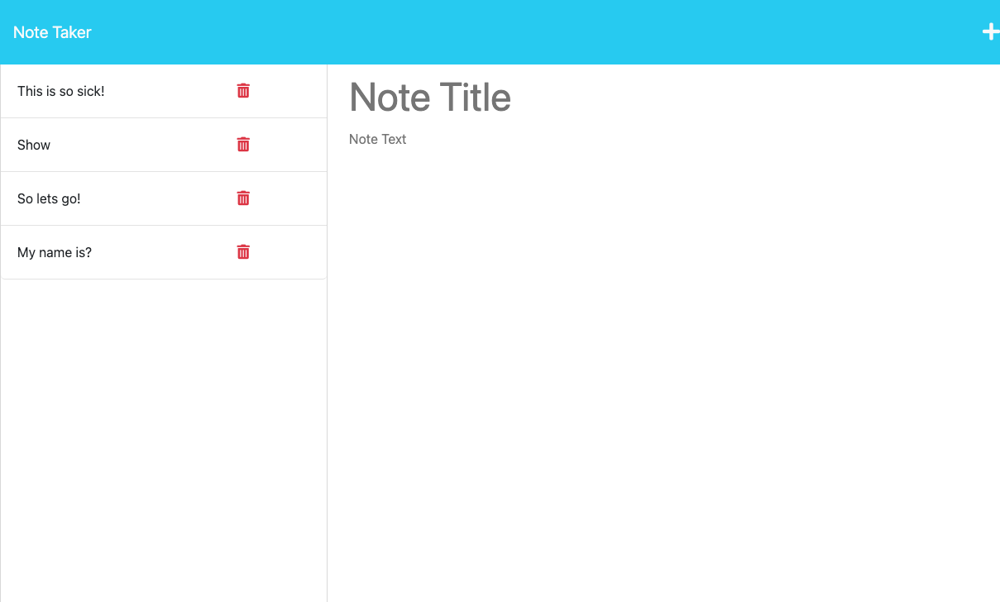

# Note Taker Starter Code

## Description

A notes application that can be used to write and save notes. This application uses an Express.js back end. 

## Table of Contents

  - [Usage](#usage)
  - [Screenshot](#screenshot)
  - [Credits](#credits)
  - [License](#license)

## Usage

To use this application, click the take notes button to begin. Then you can enter your notes or view older saved notes. To save a note, click the save icon in the top right corner. To delete a note, click the trash icon next to the note you want to delete.    

## Screenshot

## Credits
 - Manny, Professor at Boot Camp (Class notes)
 - Mdn Web Docs
 - UC Berkeley Coding Boot Camp Extension

## License

MIT License

Copyright (c) 2022 JP Padilla

Permission is hereby granted, free of charge, to any person obtaining a copy of this software and associated documentation files (the "Software"), to deal in the Software without restriction, including without limitation the rights to use, copy, modify, merge, publish, distribute, sublicense, and/or sell copies of the Software, and to permit persons to whom the Software is furnished to do so, subject to the following conditions:

The above copyright notice and this permission notice shall be included in all copies or substantial portions of the Software.

THE SOFTWARE IS PROVIDED "AS IS", WITHOUT WARRANTY OF ANY KIND, EXPRESS OR IMPLIED, INCLUDING BUT NOT LIMITED TO THE WARRANTIES OF MERCHANTABILITY, FITNESS FOR A PARTICULAR PURPOSE AND NONINFRINGEMENT. IN NO EVENT SHALL THE AUTHORS OR COPYRIGHT HOLDERS BE LIABLE FOR ANY CLAIM, DAMAGES OR OTHER LIABILITY, WHETHER IN AN ACTION OF CONTRACT, TORT OR OTHERWISE, ARISING FROM, OUT OF OR IN CONNECTION WITH THE SOFTWARE OR THE USE OR OTHER DEALINGS IN THE SOFTWARE.

